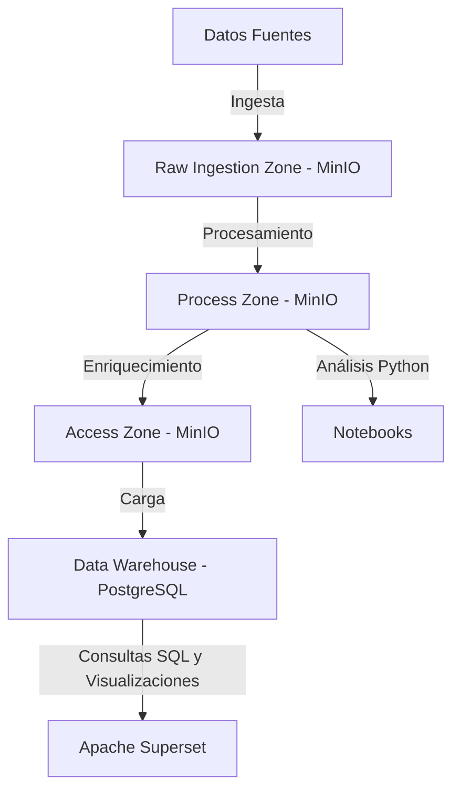

# 🏙️ Proyecto de Infraestructura de Datos para Madrid

Este repositorio contiene la implementación de una infraestructura de datos integrada para la ciudad de Madrid, diseñada para tres tipos de usuario:  
👨‍🔬 Científicos de datos expertos en python  
🏛️ Gestores municipales conocedores de SQL  
👥 Ciudadanos y asociaciones vecinales  

La solución combina un **Data Lake basado en MinIO** y un **Data Warehouse en PostgreSQL**, habilitando análisis avanzados, consultas SQL y visualizaciones intuitivas sobre datos de movilidad, participación ciudadana e infraestructura urbana.

---

## 📊 Diagrama de la Infraestructura

La infraestructura se compone de un Data Lake con MinIO dividido en tres zonas principales y un Data Warehouse en PostgreSQL conectado a Apache Superset:

- **Raw Ingestion Zone**: Almacena datos en su formato original.
- **Process Zone**: Contiene datos limpios en formato Parquet.
- **Access Zone**: Datos enriquecidos para consultas, incluyendo el Data Warehouse.

### Diagrama Conceptual



---

## 🧩 Modelo de Datos Diseñado

El modelo en PostgreSQL sigue un **esquema de estrella** con tablas de hechos y dimensiones.

### 🧱 Tablas de Dimensiones

#### `dim_distritos`
- `id` (PK, INT)
- `nombre` (VARCHAR)
- `densidad_poblacion` (FLOAT)

#### `dim_tipos_usuario`
- `id` (PK, SERIAL)
- `tipo_usuario` (VARCHAR)

#### `dim_tipos_estacion`
- `id` (PK, SERIAL)
- `tipo_estacion` (VARCHAR)

#### `dim_aparcamientos`
- `id` (PK, INT)
- `nombre` (VARCHAR)
- `capacidad_total` (INT)
- `distrito_id` (FK a `dim_distritos`)

#### `dim_date_time`
- `id` (PK, SERIAL)
- `fecha_hora` (TIMESTAMP)
- `fecha` (DATE)
- `hora` (INT)
- `dia_semana` (VARCHAR)
- `numero_dia_semana` (INT)
- `es_festivo` (BOOLEAN)
- `mes` (INT)
- `trimestre` (INT)
- `año` (INT)

### 📊 Tablas de Hechos

#### `fact_usos_bicimad`
- `id_uso` (PK, SERIAL)
- `estacion_origen_id` (INT)
- `estacion_destino_id` (INT)
- `tipo_usuario_id` (FK)
- `duracion_segundos` (FLOAT)
- `distancia_km` (FLOAT)
- `calorias_estimadas` (FLOAT)
- `co2_evitado_gramos` (FLOAT)

#### `fact_infraestructura`
- `distrito_id`, `tipo_estacion_id` (PK compuesta)
- `cantidad` (INT)

#### `fact_ocupacion_parkings`
- `aparcamiento_id`, `date_time_id` (PK compuesta)
- `plazas_ocupadas` (INT)
- `porcentaje_ocupacion` (FLOAT)
- `latitud` (FLOAT)
- `longitud` (FLOAT)
---


## ⚙️ Procesos de Transformación Implementados

### `01_ingest_data.py` – Ingesta
- Carga de archivos `.csv` y `.sql` en la zona Raw en MinIO.

### `02_process_data.py` – Procesamiento
- Limpieza y estandarización
- Conversión a formato Parquet
- Extracción desde SQL dump con SQLite

### `03_access_zone.py` – Enriquecimiento y Carga
- Agregado de columnas clave (e.g. `distrito_id`)
- Cálculo de métricas como `porcentaje_ocupacion`
- Carga en PostgreSQL

### `04_govern_zone.py` – Gobernanza
- Gestión de metadatos, linaje, seguridad y calidad

---

## 🚀 Guía de Puesta en Marcha

### 1️⃣ Clonar el repositorio
```bash
git clone https://github.com/alonso02rupa/practicIBDbicimad.git
cd practicIBDbicimad.git
```

### 2️⃣ Requisitos
- Docker + Docker Compose

### 3️⃣ Levantar los servicios
```bash
docker-compose up
```

Esto iniciará MinIO, PostgreSQL, Superset y ejecutará los scripts automáticamente.

### 4️⃣ Cargar los datos

Desde otra terminal abierta en la misma carpeta del repositorio, puedes ejecutar manualmente cada uno de los scripts con los siguientes comandos:

```bash
docker exec -it python-client python 01_ingest_data.py
docker exec -it python-client python 02_process_data.py
docker exec -it python-client python 03_access_zone.py
docker exec -it python-client python 04_govern_zone.py
```

### 5️⃣ Acceder a Superset
- URL: http://localhost:8088  
- Usuario: `admin`  
- Contraseña: `admin`

### 6️⃣ (Opcional) Verificar los datos
- MinIO: http://localhost:9000 (usuario/contraseña: `minioadmin`)

---

## 🧪 Ejemplos de Uso y Soporte a las Consultas

### 🔬 Objetivo 1: Científicos de Datos

**Pregunta**: ¿Cuáles son los horarios de mayor congestión de tráfico?

**Método**: Análisis con Python + Pandas desde Process Zone

```python
traffic_data = download_dataframe_from_minio('access-zone', 'trafico/cleaned_traffic.parquet', format='parquet')
traffic_data.groupby('hora').agg({
    'coches': 'sum', 'motos': 'sum', 'camiones': 'sum', 'buses': 'sum', 'total_vehiculos': 'sum'
}).sort_values(by='total_vehiculos', ascending=False).head(10)
```

Para ver la consulta hecha del objetivo 1, ejecutar en otra terminal el script 05_query_data.py:
```python
docker exec -it python-client python 05_query_data.py
```

En caso de querer realizar cualquier consulta adicional, modificar el archivo operando sobre los dataframes de pandas. 

---

### Conexión con Postgres

Para conectarse a la base de datos para realizar consultas SQL, se deberá acceder a superset. Desde ahí, se importará la base de datos de minio (icono '+' -> Data -> Connect Database -> PostgreSQL). Se cargará el host 'postgres' en el puerto 5432. Usuario y contraseña también serán 'postgres' (a modificar a gusto del cliente)

Una vez hecho esto, para realizar consultas, abriremos la pestaña 'SQL' y accederemos a 'SQL Lab'. Ahí se pueden realizar todas las queries necesarias seleccionando los esquemas deseados. 

Importante: se han de seleccionar los persmisos necesarios como 'Allow DDL and DML' antes de conectarse a las bases de datos para permitir el correcto funcionamiento de queries y visualizaciones

---

### 🏛️ Objetivo 2: Gestores Municipales

**1. Rutas de BiciMAD más populares**

```sql
SELECT estacion_origen_id, estacion_destino_id, COUNT(*) AS total_viajes
FROM fact_usos_bicimad
GROUP BY estacion_origen_id, estacion_destino_id
ORDER BY total_viajes DESC
LIMIT 10;
```


**2. Uso por tipo de usuario**

```sql
SELECT tipo_usuario, COUNT(*) AS total_viajes,
       ROUND(AVG(duracion_segundos) / 60, 1) AS duracion_media_min,
       ROUND(AVG(distancia_km), 2) AS distancia_media_km,
       ROUND(AVG(calorias_estimadas), 1) AS calorias_medias,
       ROUND(AVG(co2_evitado_gramos), 1) AS co2_medio
FROM fact_usos_bicimad
INNER JOIN dim_tipos_usuario ON dim_tipos_usuario.id = fact_usos_bicimad.tipo_usuario_id
GROUP BY tipo_usuario;
```


**3. Relación entre densidad poblacional e infraestructura**

```sql
SELECT d.nombre AS distrito, d.densidad_poblacion,
       SUM(f.cantidad) AS numero_paradas
FROM dim_distritos d
LEFT JOIN fact_infraestructura f ON d.id = f.distrito_id
GROUP BY d.nombre, d.densidad_poblacion
ORDER BY d.densidad_poblacion DESC;
```


---

### 👥 Objetivo 3: Ciudadanos y Asociaciones Vecinales

**Pregunta**: ¿Qué aparcamientos públicos presentan mayores variaciones de ocupación a lo largo del día y la semana, y cómo se correlacionan con su ubicación en la ciudad?

**Método**: Visualización en Superset

```sql
SELECT 
    a.id AS aparcamiento_id,
    a.nombre AS nombre_aparcamiento,
    d.nombre AS distrito,
    d.densidad_poblacion,
    STDDEV(f.porcentaje_ocupacion) AS desviacion_ocupacion,
    AVG(f.porcentaje_ocupacion) AS ocupacion_media,
    COUNT(f.porcentaje_ocupacion) AS registros_totales,
    f.latitud as latitud,
    f.longitud as longitud
FROM fact_ocupacion_parkings f
JOIN dim_aparcamientos a ON f.aparcamiento_id = a.id
JOIN dim_distritos d ON a.distrito_id = d.id
JOIN dim_date_time dt ON f.date_time_id = dt.id
GROUP BY a.id, a.nombre, d.nombre, d.densidad_poblacion, latitud, longitud
ORDER BY desviacion_ocupacion DESC;
```

**Visualización**:

Se ha de copiar la consulta SQL correspondiente y ejecutarla (botón 'RUN'). Para visualizarla, se deberá seleccionar 'Create chart'. Para resolver la primera parte de la pregunta '¿Qué aparcamientos públicos presentan mayores variaciones de ocupación a lo largo del día?', se debe realizar un diagrama de barras. En el eje X se seleccionará el nombre del aparcamiento, en el Y la suma de la correspondiente variación obtenida en la consulta. 

Posteriormente, para favorecer la visualización, se pueden ordenar acorde al eje X de manera descendente. 


Para la consulta '¿Cómo se correlacionan con su ubicación en la ciudad?', se debe definir un bubble chart (Show all charts -> En la pestaña category, seleccionar 'Correlation' -> Bubble chart. 

Se definirá como eje X la latitud (MAX para repetidos), como Y la longitud (MAX para repetidos), como identificador (entity) el distrito, y el tamaño de la bubble representará el número de casos que se encuentran en esa zona. Para definirla, usaremos la suma de la desviación requerida. 


---


---
Práctica realizada por Alonso Ruiz Palomo, Marcos Erans Batista y Juan Moreno Segura. CDIA3 2024-25
